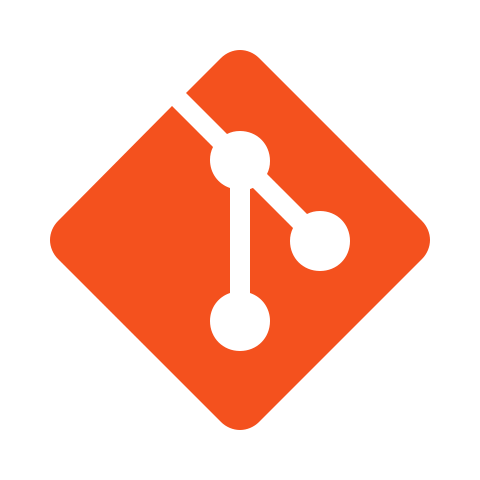

<h1 align="center">Ali Alaei</h1>
<h3 align="center">Product Manager • Flutter Frontend Developer • Software-Hardware Engineer</h3>

  <!--  -->

<!--  -->

 <!--   -->

<!--   -->

# About Me

My primary focus is **Frontend Development with Flutter**, where I build responsive, high-performance cross-platform applications for **mobile** and **web**.

Alongside frontend development, I have a solid background in **Python** and **system-level software development**, enabling me to better understand backend integration, REST APIs, and software architecture. This helps me create frontend solutions that are scalable, maintainable, and technically aligned with the overall system.

Beyond software engineering, I bring several years of experience in **Product Management** and **R&D leadership**. This experience allows me to bridge the gap between business requirements and technical implementation, transforming ideas into structured, production-ready products.

Feel free to explore my repositories to see my projects and implementations.

  
  

  

  
  
  
  
  

---

- 📫 **Email:** **<a href="mailto:a.alaei.ei@gmail.com">a.alaei.ei@gmail.com</a>**
