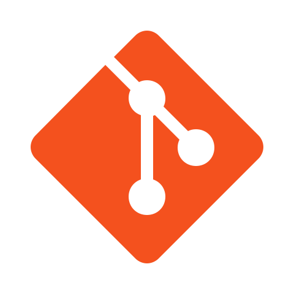

<h1 align="center">Ali Alaei</h1>
<h3 align="center">Product manager and Software-Hardware developer</h3>

<!--   
   -->

   

<h3 align="center">My Software-Hardware Skills:</h3>
<h3 align="center"><strong>FPGA  &emsp; ESP32 &emsp;  IOT &emsp;  PCB &emsp;  VHDL</strong></h3>

    <!--
  &emsp;
    
  &emsp;
    
  &emsp;
    
  &emsp;
     -->
    <!-- -->
    
    
    
    
    
    
    
    
    

<ul>
    <li>📫 How to reach me: <b><a href="a.alaei.ei@gmail.com">a.alaei.ei@gmail.com</a></b></li>
</ul>
